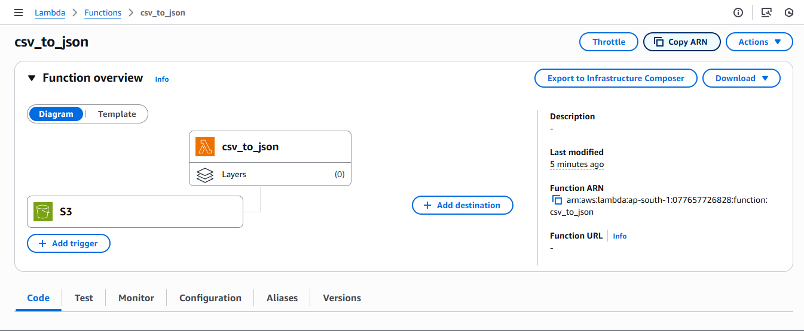
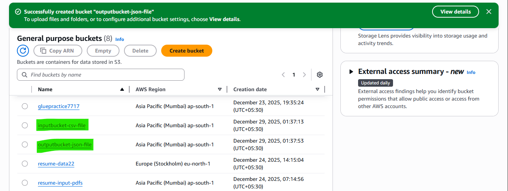
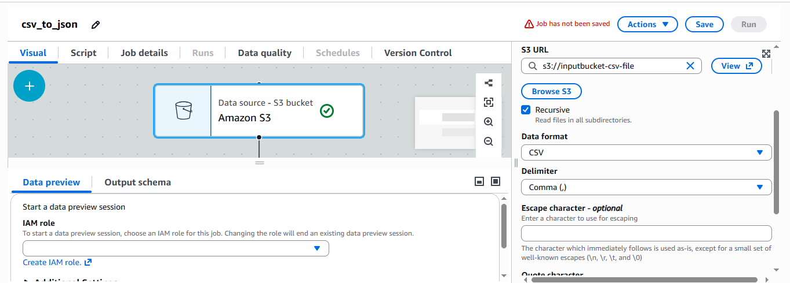
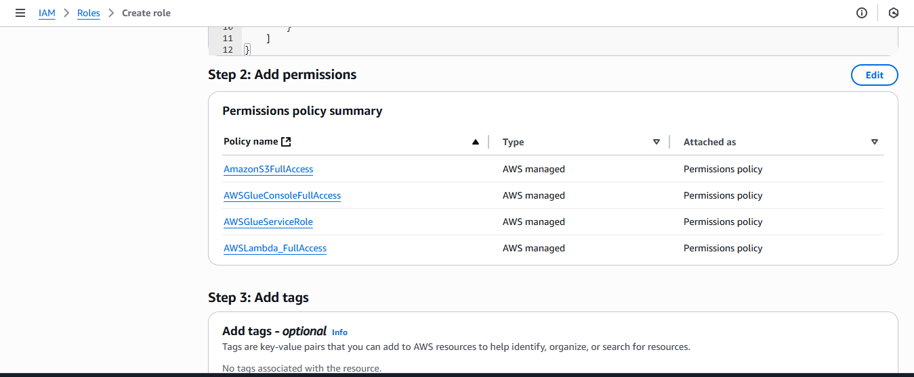
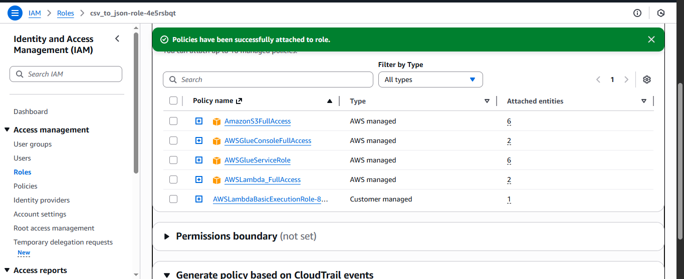
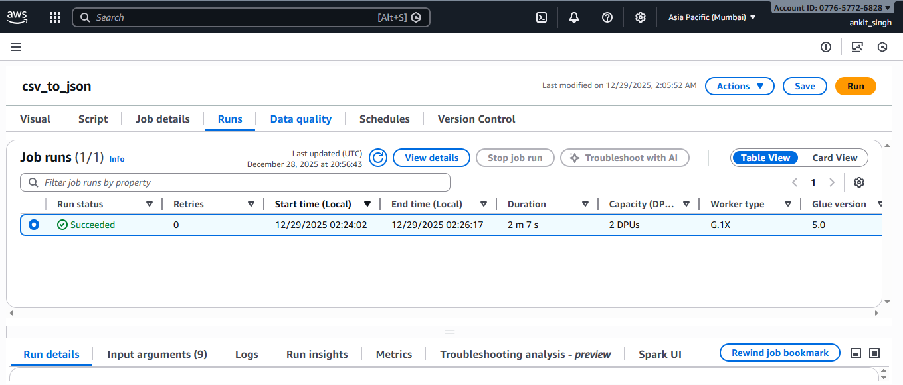

<!DOCTYPE html>
<html lang="en">
<head>
    <meta charset="UTF-8">
    <title>AWS ETL Pipeline - CSV to JSON</title>
    
</head>
<body>

<h1>AWS ETL Pipeline: CSV to JSON</h1>

This project demonstrates an <b>AWS ETL pipeline</b> where a CSV file uploaded to Amazon S3
automatically triggers an AWS Lambda function, which starts an AWS Glue ETL job to convert
CSV data into JSON format and store the output back in Amazon S3.

<h2>Architecture Overview</h2>
<ul>
    <li>Source: Amazon S3 (CSV file upload)</li>
    <li>Trigger: AWS Lambda (S3 PUT event)</li>
    <li>ETL Processing: AWS Glue</li>
    <li>Target: Amazon S3 (JSON output)</li>
</ul>

<h2>Step 1: Create S3 Buckets</h2>

Create two S3 buckets:

<ul>
    <li><b>Input Bucket</b> – to upload CSV files</li>
    <li><b>Output Bucket</b> – to store converted JSON files</li>
</ul>

<h2>Step 2: Create AWS Glue ETL Job</h2>

Create an AWS Glue ETL job that reads CSV data from the input bucket and writes JSON output
to the target bucket.

<h2>Step 3: Define ETL Source</h2>

Configure the data source in Glue to read CSV files from the input S3 bucket.

<h2>Step 4: Configure IAM Role for Glue</h2>

Attach the following policies to the Glue IAM role:

<ul>
    <li>AmazonS3FullAccess</li>
    <li>AWSGlueServiceRole</li>
    <li>AWSGlueConsoleFullAccess</li>
    <li>AWSLambda_FullAccess</li>
</ul>

<h2>Step 5: Choose S3 Path for Glue Script</h2>

While creating the Glue job, specify the script location in the following format:

<code>s3://bucket/prefix/path/</code>

<h2>Step 6: Configure Lambda Trigger</h2>

Create an AWS Lambda function and configure an S3 trigger:

<ul>
    <li>Event Type: <b>PUT</b></li>
    <li>Suffix: <b>.csv</b></li>
</ul>

<h2>Step 7: Lambda Function Code</h2>

The Lambda function triggers the AWS Glue job whenever a CSV file is uploaded.

<pre>
import json
import boto3

glueClient = boto3.client('glue')

def lambda_handler(event, context):
    glueClient.start_job_run(JobName="csv_to_json")
    return "job started"
</pre>

File name: <b>lambdafun.py</b>

<h2>Step 8: Lambda IAM Policies</h2>

Attach the following policies to the Lambda execution role:

<ul>
    <li>AmazonS3FullAccess</li>
    <li>AWSGlueConsoleFullAccess</li>
    <li>AWSGlueServiceRole</li>
    <li>AWSLambda_FullAccess</li>
    <li>AWSLambdaBasic</li>
</ul>

<h2>Step 9: Pipeline Execution</h2>

Upload a CSV file to the input S3 bucket. This triggers the Lambda function,
which starts the Glue ETL job.

<h2>Step 10: Job Completion</h2>

Once the Glue job finishes successfully, the converted JSON file is stored
in the target S3 bucket.

<h2>Output</h2>

The final JSON output can be found in the target S3 bucket.

<h3>Project Files</h3>
<ul>
    <li>csv-to-json (Glue ETL script)</li>
    <li>lambdafun.py</li>
    <li>README.html</li>
    <li>Screenshots (*.png)</li>
</ul>

<b>Result:</b> Automated, serverless ETL pipeline using AWS services.

</body>
</html>
